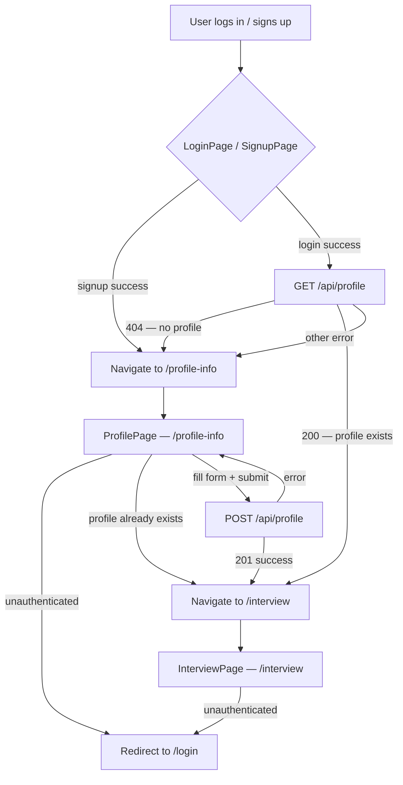
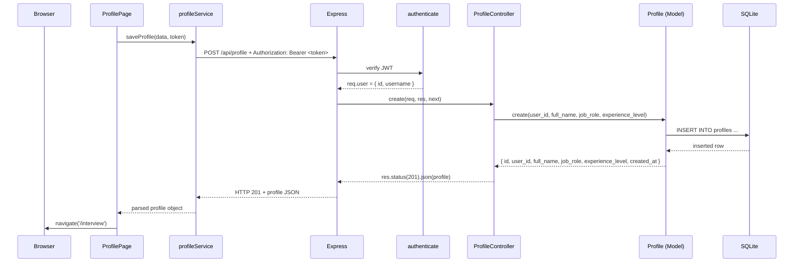

# Design Document — Profile Info

## Overview

The Profile Info feature bridges authentication and the interview session. After a user logs in or signs up, the app checks whether they already have a profile. If not, they are routed to `/profile-info` to fill in their full name, target job role, and experience level. Once saved, they are routed to `/interview`. If a profile already exists, the app skips the form entirely and routes them straight to `/interview`.

The feature spans three layers:

1. **Database** — a new `profiles` table in SQLite, linked to `users` via a foreign key.
2. **Backend** — a `Profile` model, a `ProfileController`, and a `/api/profile` router mounted in `app.js`.
3. **Frontend** — a `profileService.js` for API calls, a fully implemented `ProfilePage.jsx` at `/profile-info`, a placeholder `InterviewPage.jsx` at `/interview`, and routing updates in `App.jsx`.

The feature reuses all existing infrastructure: the `authenticate` middleware for JWT verification, `better-sqlite3` for synchronous database access, `AuthContext` for token access in the frontend, and `ProtectedRoute` for route guarding.

---

## Architecture



### Request / Response Flow for POST /api/profile



---

## Components and Interfaces

### Backend

#### `database/schema.sql` — profiles table addition

A `CREATE TABLE IF NOT EXISTS profiles` statement is appended to the existing schema file. The `User` model already calls `db.exec(schema)` on startup, so the new table is created automatically when the server starts.

#### `backend/src/models/Profile.js`

Follows the same pattern as `User.js`: opens the database via the shared singleton, runs the schema on first load, and exposes synchronous methods.

```
Profile.create(userId, fullName, jobRole, experienceLevel)
  → { id, user_id, full_name, job_role, experience_level, created_at }
  throws SqliteError on UNIQUE constraint (duplicate user_id)
  throws SqliteError on FOREIGN KEY constraint (unknown user_id)

Profile.findByUserId(userId)
  → { id, user_id, full_name, job_role, experience_level, created_at } | undefined
```

#### `backend/src/controllers/ProfileController.js`

Handles the HTTP layer. Validates inputs, delegates to `Profile` model, maps errors to HTTP status codes.

```
ProfileController.create(req, res, next)
  POST /api/profile
  Reads: req.user.id (from authenticate middleware), req.body
  Returns: 201 + profile object | 400 | 401 | 409 | 500

ProfileController.get(req, res, next)
  GET /api/profile
  Reads: req.user.id (from authenticate middleware)
  Returns: 200 + profile object | 401 | 404 | 500
```

Validation constants (defined at module level, not hardcoded inline):

```js
const VALID_JOB_ROLES = [
  'Frontend Developer', 'Backend Developer', 'Full Stack Developer',
  'DevOps Engineer', 'Data Scientist', 'UI/UX Designer',
  'Product Manager', 'QA Engineer',
];

const VALID_EXPERIENCE_LEVELS = ['Fresher', 'Junior', 'Mid-Level', 'Senior'];

const FULL_NAME_MAX_LENGTH = 100;
```

#### `backend/src/routes/profile.js`

```
Router
  POST /   → authenticate, ProfileController.create
  GET  /   → authenticate, ProfileController.get
```

Mounted in `app.js` at `/api/profile`.

#### `backend/src/app.js` — update

```js
const profileRouter = require('./routes/profile');
app.use('/api/profile', profileRouter);
```

---

### Frontend

#### `frontend/src/services/profileService.js`

Thin API client, mirrors the pattern in `authService.js`. Reads `VITE_API_URL` from the Vite environment. All functions are named exports.

```
saveProfile(profileData, token)
  → Promise<{ id, user_id, full_name, job_role, experience_level, created_at }>
  throws { status, message } on non-2xx

getProfile(token)
  → Promise<{ id, user_id, full_name, job_role, experience_level, created_at }>
  throws { status, message } on non-2xx
```

Internal helper `fetchJson(method, endpoint, token, body?)` handles the shared fetch logic (sets `Authorization: Bearer <token>`, parses JSON, throws on non-2xx).

#### `frontend/src/pages/ProfilePage.jsx` — full implementation

Replaces the existing placeholder. Responsibilities:

1. On mount: if unauthenticated, redirect to `/login`. If authenticated, call `getProfile(token)`. If profile exists (200), redirect to `/interview`. If 404, render the form. If other error, render the form (safe fallback per Requirement 2.6).
2. Render a form with three fields: full-name text input, job-role `<select>`, experience-level `<select>`.
3. Client-side validation before API call: full-name must be non-empty/non-whitespace; job-role and experience-level must be selected.
4. On submit: call `saveProfile(formData, token)`. On success, navigate to `/interview`. On error, display the error message and re-enable the submit button.
5. Loading state: disable submit button and show loading text while the API call is in-flight.
6. All colors from `variables.css` tokens. Semantic HTML: `<main>`, `<form>`, `<label>`, `<button>`. All inputs associated with labels via `htmlFor`/`id`.

State shape:
```js
const [fullName, setFullName] = useState('');
const [jobRole, setJobRole] = useState('');
const [experienceLevel, setExperienceLevel] = useState('');
const [fieldErrors, setFieldErrors] = useState({ fullName: '', jobRole: '', experienceLevel: '' });
const [apiError, setApiError] = useState('');
const [isLoading, setIsLoading] = useState(false);
const [isCheckingProfile, setIsCheckingProfile] = useState(true);
```

The `isCheckingProfile` flag prevents the form from flashing before the profile check completes. While `true`, the component renders nothing (or a minimal loading state).

#### `frontend/src/pages/InterviewPage.jsx` — new placeholder

A minimal protected page. Renders a `<main>` with an `<h1>`. No logic beyond what `ProtectedRoute` already provides.

#### `frontend/src/App.jsx` — routing updates

New routes added inside the existing `<Route element={<ProtectedRoute />}>` wrapper:

```jsx
<Route path="/profile-info" element={<ProfilePage />} />
<Route path="/interview"    element={<InterviewPage />} />
```

The existing `/profile` route (old placeholder) is removed and replaced by `/profile-info`.

#### `frontend/src/pages/LoginPage.jsx` — post-login routing update

After a successful login, instead of navigating directly to `/profile`, the page calls `getProfile(token)` and routes based on the result:
- 200 → `/interview`
- 404 → `/profile-info`
- other error → `/profile-info` (safe fallback)

#### `frontend/src/pages/SignupPage.jsx` — post-signup routing update

After a successful signup, navigate to `/profile-info` instead of `/profile`.

---

## Data Models

### `profiles` table (SQLite)

```sql
CREATE TABLE IF NOT EXISTS profiles (
  id               INTEGER PRIMARY KEY AUTOINCREMENT,
  user_id          INTEGER NOT NULL UNIQUE,
  full_name        TEXT    NOT NULL,
  job_role         TEXT    NOT NULL,
  experience_level TEXT    NOT NULL,
  created_at       TEXT    NOT NULL DEFAULT (datetime('now')),
  FOREIGN KEY (user_id) REFERENCES users(id)
);
```

**Constraints:**
- `user_id` is `UNIQUE` — one profile per user, enforced at the database level.
- `FOREIGN KEY (user_id) REFERENCES users(id)` — orphaned profiles are impossible.
- All text columns are `NOT NULL` — no partial profiles.

**Note:** SQLite foreign key enforcement requires `PRAGMA foreign_keys = ON` to be set at connection time. The `Profile` model must set this pragma when opening the database (same as `journal_mode = WAL` in `User.js`).

### Profile object (API response shape)

```json
{
  "id": 1,
  "user_id": 42,
  "full_name": "Jane Smith",
  "job_role": "Backend Developer",
  "experience_level": "Mid-Level",
  "created_at": "2024-01-15T10:30:00"
}
```

### Validation rules (backend)

| Field              | Rule                                                        | Error HTTP |
|--------------------|-------------------------------------------------------------|------------|
| `full_name`        | Required, non-empty after trim, max 100 characters          | 400        |
| `job_role`         | Required, must be one of 8 permitted values                 | 400        |
| `experience_level` | Required, must be one of 4 permitted values                 | 400        |
| JWT                | Must be present and valid in `Authorization: Bearer` header | 401        |
| Duplicate profile  | `user_id` already has a profile row                         | 409        |

---


## Error Handling

### Backend

**ProfileController.create:**
- Missing or whitespace-only `full_name` → 400 `{ error: 'Full name is required' }`
- Missing or empty `job_role` → 400 `{ error: 'Job role is required' }`
- Missing or empty `experience_level` → 400 `{ error: 'Experience level is required' }`
- `job_role` not in permitted list → 400 `{ error: 'Invalid job role' }`
- `experience_level` not in permitted list → 400 `{ error: 'Invalid experience level' }`
- SQLite UNIQUE constraint on `user_id` → 409 `{ error: 'Profile already exists for this user' }`
- SQLite FOREIGN KEY violation → 500 via `next(err)` (should not occur in practice since `req.user.id` comes from a verified JWT)
- Any other unexpected error → `next(err)` → global error handler → 500

**ProfileController.get:**
- Profile not found → 404 `{ error: 'Profile not found' }`
- Any unexpected error → `next(err)` → 500

**authenticate middleware** (already implemented) handles all 401 cases.

All log entries follow the existing format: `[timestamp] [severity] [source] message`.

### Frontend

**ProfilePage:**
- Profile check (GET) fails with non-404 error → silently fall through to render the form (safe fallback, per Requirement 2.6). Log a warning to the console.
- Profile check (GET) returns 200 → redirect to `/interview` before rendering the form.
- Form submission error → display `err.message` in the dedicated error area above the submit button. Re-enable the submit button. Preserve all field values.
- Token absent or expired on mount → redirect to `/login` (handled by `ProtectedRoute`).

**profileService:**
- Non-2xx response → throw `{ status, message }` where `message` is the `error` field from the response body, or a generic fallback string if absent.
- Network failure (fetch throws) → let the error propagate; the caller (ProfilePage) catches it and displays a generic message.

---

